<h1 align="center">Documentación Streaming</h1>
<p align="center"></p>
<br>
<p><b>Nombre: </b>Israel Moreno Ballesta</p>
<p><b>Curso: </b>2ºASIR</p>
<p><b>Asignatura: </b>Servicios de Red e Internet</p>
<p><b>Fecha: </b> 21/01/2026</p>

# ÍNDICE

- [Introducción](#introducción)
- [Práctica: radio online](#práctica-radio-online)
  - [Icecast 2](#icecast-2)
  - [Mixxx](#mixxx)
  - [VLC](#vlc)
- [Práctica vídeo](#práctica-vídeo)
- [Anexo](#anexo)

## Introducción

Servicios de streaming son sistemas que permiten transmitir audio y vídeo por Internet sin descargar el archivo completo. Funcionan enviando el contenido en tiempo real mediante protocolos especializados y servidores dedicados. Son esenciales para reproducir música, películas y emisiones en directo desde cualquier dispositivo, adaptándose a la velocidad de conexión del usuario.

## Práctica: radio online

### Icecast 2

Instalamos Icecast 2 en una máquina Ubuntu que hará de servidor.

Primero haremos un update para que el sistema actualice la lista de paquetes disponibles, y después ejecutaremos el comando para instalar Icecast 2.

```
apt update
apt install icecast2
```

### Mixxx

En otra máquina Ubuntu vamos a instalar la aplicación Mixxx.

Para ello primero añadimos los repositorios, después hacemos un update para que el sistema actualice la lista de paquetes disponibles, y después instalamos la aplicación.

```
add-apt-repository ppa:mixxx/mixxx
apt update
apt install mixxx
```

<a name="paso-1"></a>
Una vez tenemos instalada la aplicación, la ejecutamos, vamos a **Opciones → Preferencias** y en **Emisión en vivo** configuramos los parámetros necesarios tomando como referencia la imagen del anexo. [Ver imagen](#configuración-emisión-en-vivo)

<a name="paso-2"></a>
Una vez hecho esto, le damos a aplicar y a aceptar, insertamos una música y le damos al botón que pone **ON AIR**. [Ver imagen](#emitir-en-vivo)

<a name="paso-3"></a>
Esperamos a que el botón **ON AIR** se ponga en verde que significará que ya estamos emitiendo y le damos al **Play** para que la música comience. [Ver imagen](#comprobación-emisión-en-vivo)

<a name="paso-4"></a>
Ahora vamos a la máquina que hace de servidor, abrimos el navegador y escribimos la dirección correspondiente, que en mi caso es `192.168.1.58:8000/israel`, para comprobar que la emisión se está realizando correctamente. [Ver imagen](#comprobación-desde-el-navegador)

<a name="paso-5"></a>

### VLC

Y ahora vamos a hacerlo desde la aplicación VLC.

Instalamos la aplicación.

```
apt install vlc
```

Una vez instalada, abrimos la aplicación, vamos a **Medio → Abrir ubicación de red** ponemos la dirección `http://192.168.1.58:8000/israel` y le damos a reproducir. [Ver imágenes](#comprobación-desde-vlc)

<a name="paso-6"></a>

Ahora vamos a acceder a la radio de un compañero tanto desde el navegador como desde VLC. [Ver imágenes](#acceso-a-un-compañero)

## Práctica vídeo

Instalamos FFmpeg para poder manipular y analizar archivos de vídeo.

```
apt install ffmpeg
```
<a name="paso-7"></a>

Nos descargamos un vídeo de prueba y ejecutamos el siguiente comando para ver la información técnica del archivo.

```
ffprobe -v error -show_streams big-buck-bunny.mp4
```

Podremos localizar parámetros como los siguientes.

- **Códec de vídeo:** h264
- **Resolución:** 1920x1080
- **Framerate:** 24 fps
- **Bitrate de vídeo:** 5.86 Mbps
- **Códec de audio:** AAC
- **Frecuencia de muestreo:** 48 kHz
- **Número de canales:** 5.1 (6 canales)
- **Duración total:** 30 segundos

En la imagen se ha usado una versión filtrada del comando para mostrar solo los campos relevantes. [Ver imagen](#información-obtenida-con-ffprobe)

<a name="paso-8"></a>

Ahora vamos a hacer un cambio de contenedor de MP4 a MKV.

```
ffmpeg -i big-buck-bunny.mp4 -c:v copy -c:a copy big-buck-bunny.mkv
```

Con las opciones `-c:v copy -c:a copy` le indicamos que se copien los flujos de vídeo y audio sin recodificarlos, cambiando únicamente el contenedor de MP4 a MKV. [Ver imagen](#cambio-de-contenedor-de-mp4-a-mkv)

> **a) ¿Ha cambiado el tamaño de forma significativa?**
>
> No, el tamaño del archivo no cambia significativamente porque no se recodifica nada. Solo se cambia el contenedor de MP4 a MKV, y eso añade o quita unos pocos KB como mucho.

> **b) ¿Ha habido carga de CPU? ¿Ha tardado mucho?**
>
> No, no ha habido prácticamente carga de CPU porque no se realiza ninguna recodificación. El proceso es casi inmediato, ya que FFmpeg solo copia los streams al nuevo contenedor.

A continuación vamos a realizar un cambio de códecs y compararlos.

<a name="paso-9"></a>

Creamos el fichero H.264 con un bitrate de 2Mbps. [Ver imagen](#fichero-h264-con-bitrate-de-2mbps)
```
ffmpeg -i big-buck-bunny.mp4 -c:v libx264 -b:v 2M -c:a copy h264_2mbps.mp4
```

<a name="paso-10"></a>

Creamos el fichero H.265 con un bitrate de 2Mbps. [Ver imagen](#fichero-h265-con-bitrate-de-2mbps)
```
ffmpeg -i big-buck-bunny.mp4 -c:v libx265 -b:v 2M -c:a copy h265_2mbps.mp4
```

> - **¿Cuál de los dos presenta más "artefactos" (cuadraditos)?**
>
> El vídeo codificado en H.264 muestra más artefactos en escenas con mucho movimiento. Esto ocurre porque H.264 es menos eficiente que H.265 a la hora de comprimir zonas complejas manteniendo el detalle.

> - **Si ambos tienen el mismo bitrate (2 Mbps), ¿pesan lo mismo los archivos finales?**
>
> No, el tamaño final no es exactamente igual. Aunque el bitrate es el mismo, cada códec organiza y comprime los datos de forma distinta, por lo que siempre hay pequeñas diferencias en el peso del archivo.

<a name="paso-11"></a>

Y por último vamos a hacer una simulación de streaming con diferentes tipos de fichero.

Primero vamos a hacer una simulación **Low (móvil)** con **resolución de 240p** y un **bitrate de 400k** [Ver imagen](#simulación-de-streaming-low)

```
ffmpeg -i big-buck-bunny.mp4 -s 426x240 -b:v 400k -c:a aac -b:a 64k low_240p_400k.mp4
```

<a name="paso-12"></a>

Y después vamos a hacer una simulación **High (fibra)** con **resolución de 1080p** y un **bitrate de 2Mbps** [Ver imagen](#simulación-de-streaming-high)

```
ffmpeg -i big-buck-bunny.mp4 -s 1920x1080 -b:v 2M -c:a aac -b:a 128k high_1080p_2mbps.mp4
```

### Preguntas finales: 

> - **Almacenamiento: Si tu servidor tiene un disco de 500 GB, ¿cuántas horas de vídeo del perfil "HD" (2 Mbps) podrías alojar?**
>
> Primero pasamos los 500 GB a gigabits (500 × 8 = 4000 Gb) y después a megabits (4000 × 1000 = 4.000.000 Mb). Lo dividimos entre 2 Mbps y obtenemos 2.000.000 segundos de vídeo, que equivalen aproximadamente a 555 horas. 

> - **Red: Tienes una línea de 100 Mbps simétricos. ¿Cuántos usuarios podrían ver el perfil "Móvil" (400 kbps) simultáneamente antes de saturar el 80% de la línea?**
>
> Primero calculamos el 80% de la línea (100 × 0,8 = 80 Mbps) y después convertimos los 400 kbps del perfil móvil a Mbps (400 ÷ 1000 = 0,4 Mbps). Dividimos los 80 Mbps disponibles entre 0,4 Mbps por usuario y obtenemos un total de 200 usuarios antes de alcanzar el 80% de uso de la conexión.

## Anexo

### Configuración emisión en vivo

<p align="center">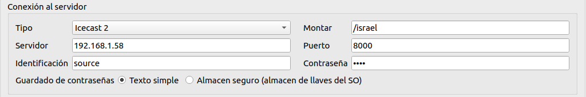</p>

[Volver](#paso-1)

### Emitir en vivo

<p align="center">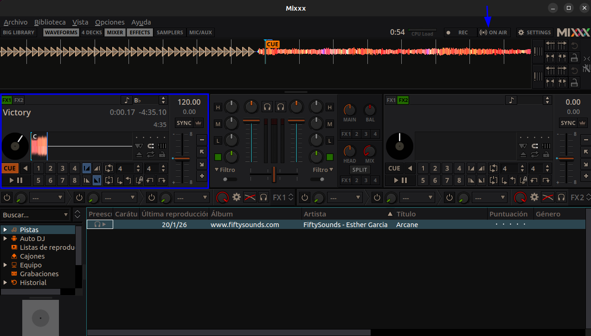</p>

[Volver](#paso-2)

### Comprobación emisión en vivo

<p align="center">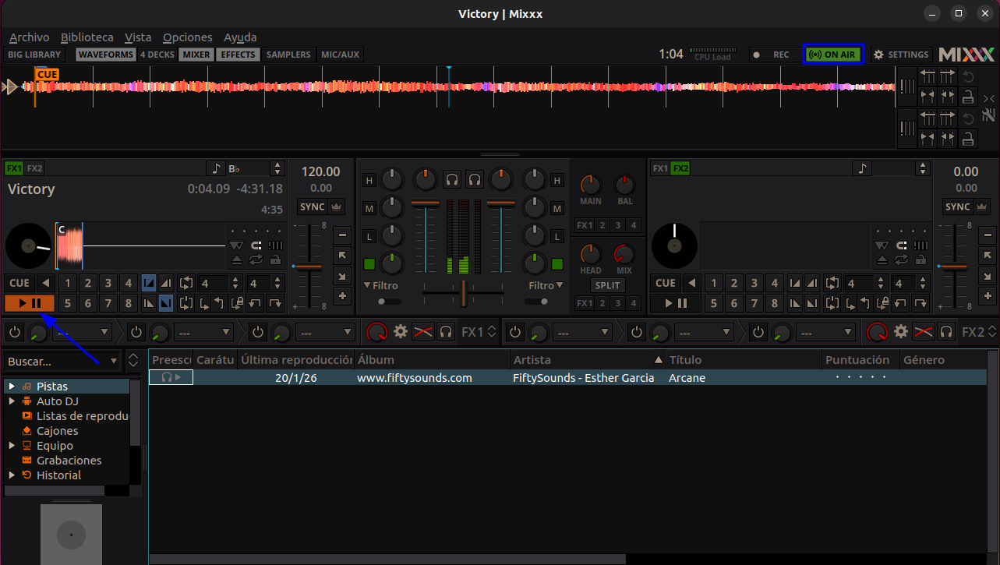</p>

[Volver](#paso-3)

### Comprobación desde el navegador

<p align="center">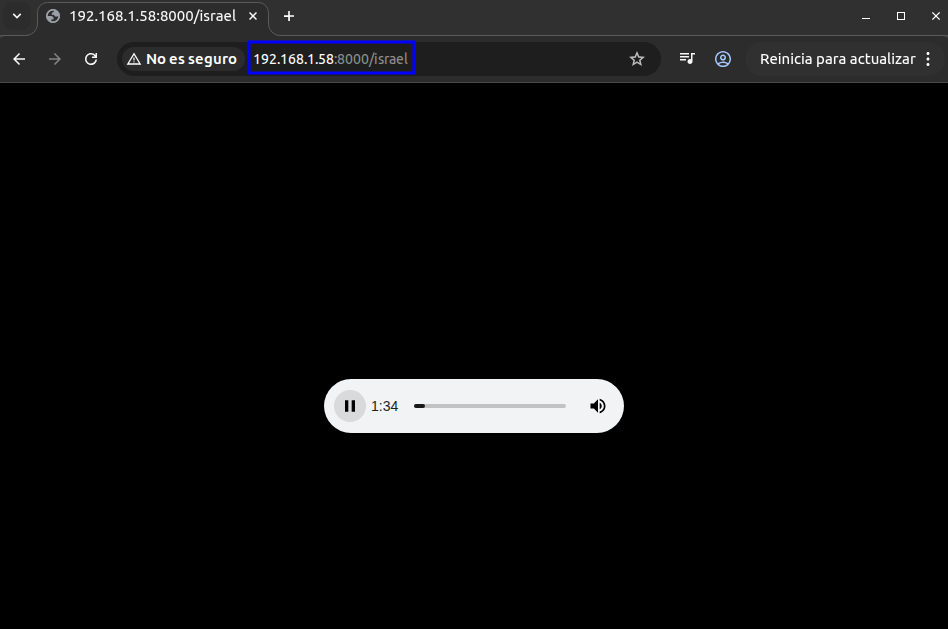</p>

[Volver](#paso-4)

### Comprobación desde VLC

<p align="center">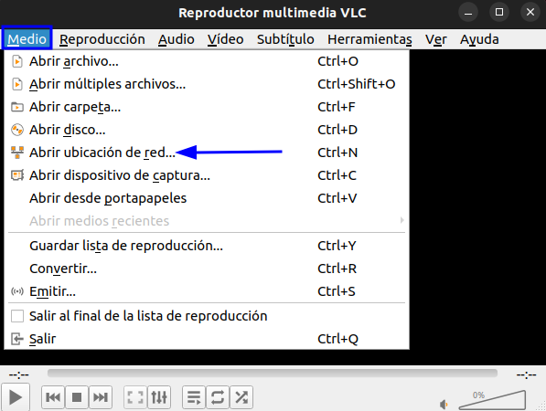</p>
<p align="center">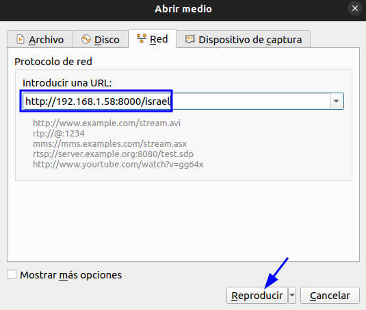</p>
<p align="center">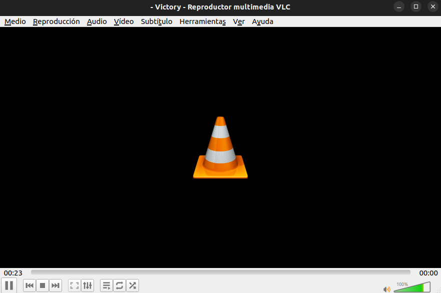</p>

[Volver](#paso-5)

### Acceso a un compañero

#### Navegador

<p align="center">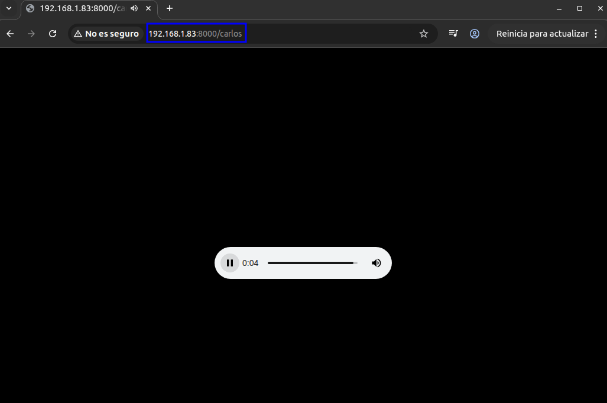</p>

#### VLC

<p align="center"></p>
<p align="center">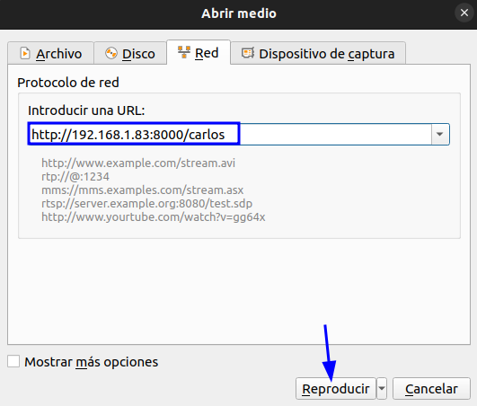</p>
<p align="center">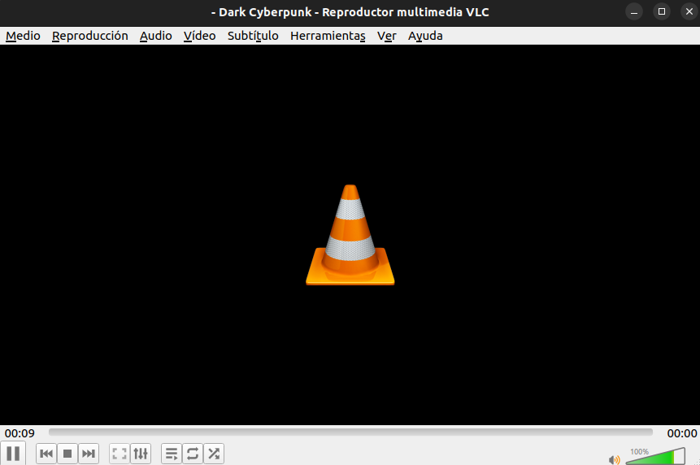</p>

[Volver](#paso-6)

### Información obtenida con ffprobe

<p align="center">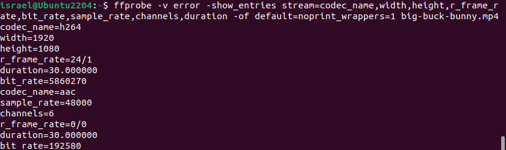</p>

[Volver](#paso-7)

### Cambio de contenedor de MP4 a MKV

<p align="center">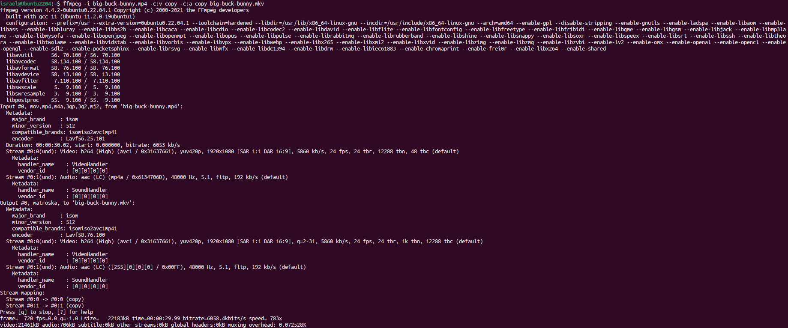</p>

[Volver](#paso-8)

### Fichero H.264 con bitrate de 2Mbps

<p align="center">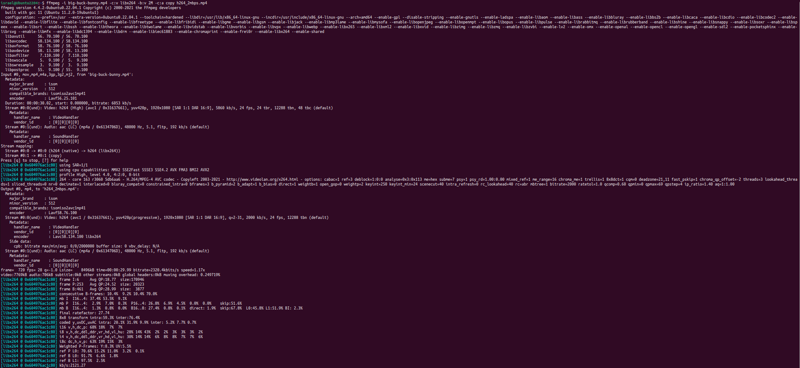</p>

[Volver](#paso-9)

### Fichero H.265 con bitrate de 2Mbps

<p align="center">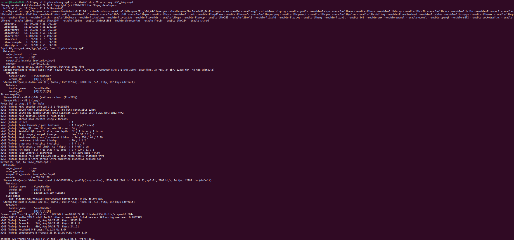</p>

[Volver](#paso-10)

### Simulación de streaming Low

<p align="center">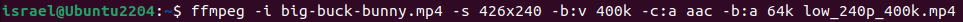</p>
<p align="center">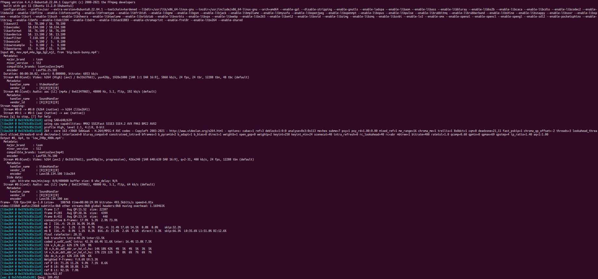</p>

[Volver](#paso-11)

### Simulación de streaming High

<p align="center">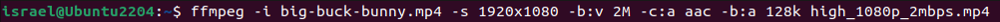</p>
<p align="center">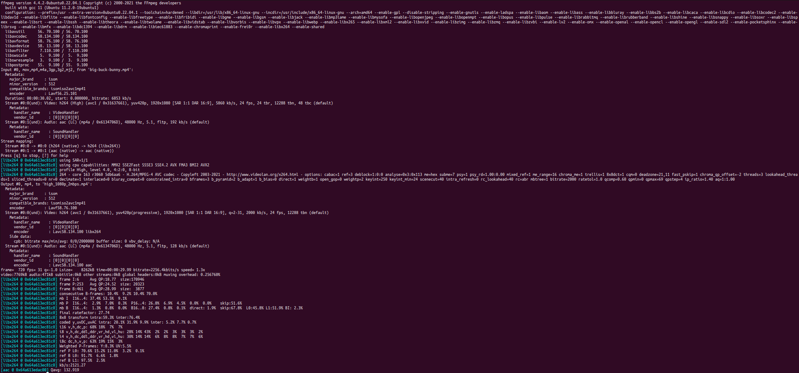</p>

[Volver](#paso-12)
