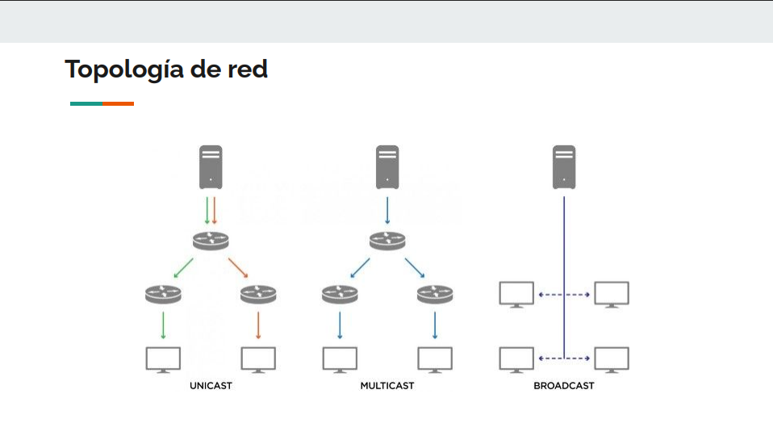
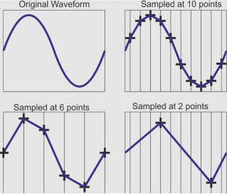
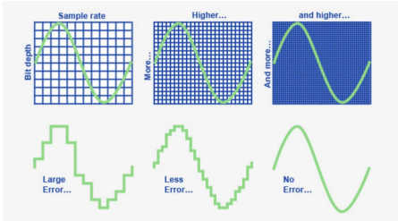
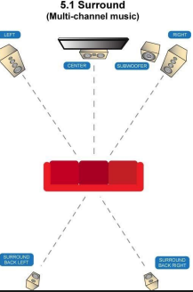
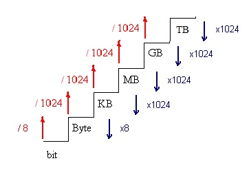

# Índice
## 1. Descarga directa vs Streaming
## 2. Topología de red
## 3. Capa de transporte: TCP vs UDP
## 4. QoS: Jitter, Buffer
## 5. Protocolos streaming
## 6. Icecast

# Qué es
## Descarga directa vs Streaming

- **Descarga Directa:** el usuario demanda un fichero con un peso de 100MB y 10 minutos de duración. Comienza la descarga. Se almacena en buffer y comienza la reproducción. El usuario termina la reproducción a los 2 minutos. El servidor ha entregado las 100MB.
- **Streaming:** Datos enviados en flujo constante. No hay almacenamiento local permanente. Solo se consume el ancho de banda que el cliente ha utilizado (2 minutos según el ejemplo anterior).

# Topología de red

<p align="center"></p>

- **Unicast:** conexión 1 a 1 (estándar de internet)
    - **Mecánica:** Si hay 100 oyentes, el servidor abre 100 sockets TCP y envía la información 100 veces.
    - **Cálculo de Ancho de Banda:** $BW_{tot} = BW_{stream} \times N_{usuarios}$
    - **Desventaja:** Poco escalable.

- **Multicast:**
    - **Mecánica:** El servidor envía la información a una dirección multicast (224.0.0.0 - 239.255.255.255). Routers replican el paquete solo si tienen suscriptores.
    - **Desventaja:** Routers bloquean paquetes multicast. Solo viable en redes internas.

# QoS: Jitter, Buffer

## Jitter (Fluctuación)
Es la variación en el tiempo de llegada de los paquetes.
- **Ejemplo:** El paquete 1 tarda 20ms, el paquete 2 tarda 150ms, el paquete 3 tarda 20ms.
- **Consecuencia:** Si el Jitter es superior al tamaño del buffer, el audio se corta (**Buffer Underrun**).

## Buffer (Amortiguador)
Es una memoria temporal en el cliente (y en el servidor).
- **Función:** Acumular suficientes segundos de audio para absorber el Jitter de la red.
- **Efecto:** A mayor buffer → Mayor estabilidad → Mayor latencia (retraso).

## Burst-on-Connect (Ráfaga de conexión)
Una característica específica de servidores como Icecast.

- **Problema:** Al conectarse, el oyente tardaría varios segundos en llenar su buffer a velocidad normal (1x).
- **Solución (Burst):** El servidor envía los datos iniciales (ej. 64KB) a la máxima velocidad posible que permita la red (ej. 10x), llenando el buffer del cliente casi instantáneamente para que el audio empiece a sonar de inmediato (**Time-to-first-byte** reducido).

# Protocolos de Streaming

## 1. Capa de transporte: TCP vs UDP

### TCP (Transmission Control Protocol)
En TCP, si un paquete de audio/vídeo se pierde, el cliente no lo reproduce y, por tanto, el servidor lo reenvía (**ACK/NACK**).

- **Ventajas:** Calidad asegurada y alta compatibilidad. Pasa sin problemas por firewalls, NAT y proxies al usar puertos estándar.
- **Desventaja:** Alta latencia. La retransmisión de paquetes introduce un retraso acumulativo.

### UDP (User Datagram Protocol)
En este protocolo, se prioriza la velocidad sobre la integridad del flujo de datos.

- **Mecánica:** Se sacrifica la calidad (si se pierde un paquete, se ignora) a cambio de una **latencia mínima**. Es ideal para aplicaciones en tiempo real donde el reenvío de datos antiguos ya no es útil.

### ¿Entonces todo audio/vídeo por UDP?
**NO**

## 2. Capa de aplicación (tres modelos)
1. **HTTP Legacy** (como usa Icecast2 - lo veremos más adelante)
2. **HTTP Adaptativo**
3. **Real-time**

### HTTP… TCP ¿no?

## Protocolos de Streaming

### HTTP Legacy (como usa Icecast2 - lo veremos más adelante)
* **Protocolo:** ICY
* **Mecánica:** se abre conexión TCP y el servidor envía flujo de datos sin parar hasta que el cliente cierra la conexión.
* **Puertos:** 80, 443, 8000 (Icecast2)
* **Formato:** flujo continuo de bytes (MP3, Ogg, AAC).

### HTTP Adaptativo
* **Protocolos:** HLS (HTTP Live Streaming de Apple) - MPEG-DASH.
* **Mecánica:** no es flujo continuo. El servidor trocea el fichero en pequeños trozos (chunks) de 2 a 10 segundos.
* **Formato:** .ts, .m4s.
* **Pro:** calidad adaptativa. El servidor envía un Manifest con el que da la opción a descargar un chunk de mejor o peor calidad.

## Protocolos de Streaming

### Real-Time
- **RTMP (Real-Time Messaging Protocol):** funciona sobre TCP. Está obsoleto para usuario final pero se usa para enviar vídeo al servidor (por ejemplo de OBS a YT/Twitch).
- **RTSP (Real-Time Streaming Protocol):** usado en cámaras de seguridad (CCTV) y sistemas domóticos. Generalmente usa UDP para datos y TCP para control.
- **WebRTC:** para videoconferencia. P2P, cifrado, UDP, funciona en navegador sin plugins (Google Meet, Discord).

# Protocolos de Streaming
## Cuadro resumen

| Protocolo | Base | Latencia Típica | Uso Principal | Facilidad Firewall | Caché (CDN) |
| :--- | :--- | :--- | :--- | :--- | :--- |
| **Icecast (ICY)** | TCP/HTTP | 10s - 30s | Radio Online, Audio simple | Muy fácil | Difícil |
| **HLS / DASH** | TCP/HTTP | 15s - 45s | Netflix, YouTube, TV Online | Muy fácil | Excelente |
| **RTMP** | TCP | 2s - 5s | Ingesta (OBS a Servidor) | Medio | No |
| **WebRTC** | UDP/TCP | < 0.5s | Zoom, Meet, Discord | Complejo | No |
| **RTSP** | UDP+TCP | < 1s | Cámaras IP, Seguridad | Problemas NAT | No |

# Protocolos de Streaming

Como hemos visto, la industria utiliza mucho más **TCP** que **UDP**.

- **Netflix, HBO, Disney+, etc.:** utilizan **HTTP adaptativo**. Al ver una película estás descargando pequeños chunks (trozos del vídeo) secuencialmente vía TCP.
- **Spotify y Apple Music:** también usan **TCP**. Por eso, si hay problemas, la canción se para en lugar de escucharse con errores o fragmentos perdidos como ocurriría en una videollamada.
- **Twitch (lado del receptor):** usa **TCP**, razón por la cual existe un delay (retraso).
- **Radio online:** también es **TCP** (ejemplo: Icecast2).

**Regla general:** Cuando se necesita interactuar con la otra parte, el delay no es admisible y, por tanto, se utiliza **UDP**.

<p align="center"></p>

# Icecast 2

Icecast2 es un software de servidor de streaming de medios de código abierto. En términos sencillos, actúa como una "antena de radio virtual" en internet: recibe el audio de una fuente (un locutor o una lista de reproducción) y lo distribuye a miles de oyentes simultáneamente.

Icecast2 **NO genera el contenido**, solo lo distribuye. Por tanto, necesita de un cliente que le entregue contenidos.

- **Formatos:** OGG / MP3
- **Gestión de oyentes**
- **Puntos de montaje:** (ej. `/radio-asir` y `/radio-smr`)

# Icecast 2: Instalación y Configuración inicial

1. Actualizar repositorios:
   `apt update`

2. Instalar el paquete:
   `apt install icecast2`

3. **Configuración:**
   - Configura las contraseñas (se recomienda usar la misma para todas las opciones durante las pruebas).

4. **Verificación:**
   - Comprueba que el puerto **8000** esté abierto.

# Mixxx

Para instalar el cliente de streaming Mixxx, utiliza los siguientes comandos:

1. Añadir el repositorio oficial:
   `add-apt-repository ppa:mixxx/mixxx`

2. Actualizar la lista de paquetes:
   `apt update`

3. Instalar la aplicación:
   `apt install mixxx`

# Práctica 1 + Documentación en Markdown y Git

1. **Monta un Ubuntu 24 como servidor de streaming**
    - **Red:** Adaptador puente (configura como fija la IP que te dé el DHCP).
    - **Sonido:** Comprueba que funciona correctamente.
    - **Instalación:** Instala `icecast2`.

2. **Monta otro Ubuntu 24 como DJ**
    - **Red:** Adaptador puente.
    - **Sonido:** Comprueba que funciona el sonido.
    - **Instalación:** Instala `mixxx`.
    - **Configuración:** Crea una radio con tu nombre (ej. punto de montaje `/manu`).

3. **Comprobación en la máquina anfitrión**
    - Verifica que escuchas tus ficheros desde el equipo host.
    - Utiliza dos métodos: desde el **navegador** y desde **VLC**.

4. **Interconexión**
    - Escucha la radio de otro compañero para verificar la conectividad en red.

# Códecs

Son algoritmos que permiten la compresión de los ficheros de audio/vídeo, así como su descompresión.

- **¿Para qué?** Para reducir el trasiego de información sin perder calidad.
- **Ejemplo:** Una canción de 3 minutos en calidad CD sin compresión podría pesar unos 32MB. La misma canción en MP3 (comprimida) pesaría unos 3MB.
- **Ejemplos de códecs de audio:** MP3, AAC, Vorbis, WAV.
- **Ejemplos de códecs de vídeo:** H.264, H.265, AV1.

## Frecuencia de muestreo
El audio es una onda analógica. Para digitalizarla hay que muestrearla, algo así como hacerle "fotos" cada cierto tiempo.

- **Estándar:** 44,1kHz.

<p align="center"></p>

## Profundidad de bits
Si la frecuencia de muestreo eran las “fotos” que hacíamos a la onda, la profundidad es la calidad de dicha foto. 

Se trata de la cantidad de bits que se transmiten por segundo: a mayor cantidad, más calidad.

- **Estándar:** 16 bit (calidad CD)

<p align="center"></p>

## Canales
Número de audios independientes que viajan en el mismo stream.

<p align="center"></p>

## Códecs con pérdida / sin pérdida

- **Códecs con pérdida:** reducen peso sacrificando información que puede ser imperceptible por el oído humano. Al comprimirlo dicha información se pierde y es irrecuperable.
    - **Ejemplo:** MP3.
- **Códecs sin pérdida:** comprime el fichero como lo haría un .zip pero sin eliminar información. Al descomprimir el flujo de bits es idéntico al original. El factor de compresión es menor a los códecs con pérdida.
    - **Ejemplo:** FLAC, WAV.

# Cálculo de peso (Audio sin compresión)

La fórmula para calcular el peso de un archivo de audio digital es:

$$Peso = Frecuencia \times Bits \times Canales \times Segundos$$

### Ejemplo práctico:
**Sin compresión WAV:** 3 minutos de canción en estéreo con frecuencia de muestreo de 44,1kHz y profundidad de 16 bits.

$$P = 44100 \times 16 \times 2 \times 3 \times 60 = 254016000 \text{ bits}$$
$$254016000 / 8 = 31752000 \text{ bytes (aprox. 31,75MB)}$$

---

# Ejercicios de Cálculo: Peso y Ancho de Banda

### 1. Cálculo de peso de archivo sin compresión (WAV)
**Enunciado:** Archivo de 5 minutos, 44,1 kHz, 16 bits, estéreo.

* **Fórmula:** $Peso = Frecuencia \times Bits \times Canales \times Segundos$
* **Cálculo:**
    * $44100 \text{ Hz} \times 16 \text{ bits} \times 2 \text{ canales} \times 300 \text{ segundos (5 min)} = 423.360.000 \text{ bits}$
    * Pasamos a Bytes: $423.360.000 / 8 = 52.920.000 \text{ Bytes}$
* **Resultado:** **52,92 MB** aproximadamente.
* **Explicación:** Multiplicamos todas las variables de la muestra digital para obtener el total de bits y luego dividimos entre 8 para obtener el tamaño en Bytes, que es la unidad comercial de almacenamiento.

### 2. Consumo de ancho de banda del servidor
**Enunciado:** Streaming MP3 a 128 kbps con 25 oyentes simultáneos.

* **Cálculo:**
    * $128 \text{ kbps} \times 25 \text{ oyentes} = 3200 \text{ kbps}$
    * Pasamos a Mbps: $3200 / 1024 = 3,125 \text{ Mbps}$
* **Resultado:** **3,125 Mbps**.
* **Explicación:** En streaming, el servidor debe enviar una copia del flujo de datos a cada cliente. El ancho de banda total es el bitrate de la emisión multiplicado por el número de usuarios conectados.

### 3. Cálculo de bitrate (flujo de datos)
**Enunciado:** Frecuencia de 48 kHz, 24 bits, mono (1 canal).

* **Fórmula:** $Bitrate = Frecuencia \times Profundidad \times Canales$
* **Cálculo:**
    * $48000 \text{ Hz} \times 24 \text{ bits} \times 1 \text{ canal} = 1.152.000 \text{ bits por segundo (bps)}$
* **Resultado:** **1152 kbps (o 1,15 Mbps)**.
* **Explicación:** El bitrate es la cantidad de información que se procesa por segundo. Al ser un solo canal (mono), el flujo es menor que si fuera estéreo, pero la alta frecuencia y profundidad (24 bits) elevan la calidad y el peso.

### 4. Capacidad máxima de oyentes
**Enunciado:** Límite de subida de 10 Mbps para oyentes a 192 kbps.

* **Cálculo:**
    * Convertimos el límite a kbps: $10 \text{ Mbps} \times 1024 = 10240 \text{ kbps}$
    * Dividimos por el bitrate del oyente: $10240 / 192 = 53,33$
* **Resultado:** **53 oyentes** (teóricos).
* **Explicación:** Dividimos la capacidad total de la "tubería" (subida del servidor) entre lo que consume cada usuario. Siempre redondeamos hacia abajo, ya que el oyente número 54 saturaría la red y causaría cortes (jitter/buffer).

# Vídeo

La lógica y los conceptos para el vídeo son muy similares a los del audio. También contamos con protocolos y códecs, pero se introduce el concepto de **contenedor**.

### Contenedor
Es un formato de fichero que sirve como "caja" para agrupar diferentes elementos:
* **Pistas de vídeo.**
* **Pistas de audio.**
* **Subtítulos.**
* **Metadatos.**

**Ejemplos de contenedores:** MP4, MKV, MOV, OGG.

# Cálculo de peso (Vídeo)

### 1. Vídeo sin compresión
$$Peso = (Ancho \times Alto) \times Profundidad \text{ de color} \times FPS \times Tiempo$$

* **Resoluciones comunes:**
    * **1080p:** $1920 \times 1080$
    * **4K:** $4096 \times 2160$
    * **8K:** $7680 \times 4320$
* **Profundidad de color:** Bits usados para definir el color de cada píxel (habitualmente 24 bits: 8+8+8).
* **FPS:** Frames (fotos) por segundo.

### 2. Vídeo con compresión (uso de Códec)
Al utilizar un códec, se comprime el vídeo y ya no se envía píxel a píxel. En este caso, el dato clave es el **Bitrate**.

$$Peso = Bitrate \times Tiempo$$

* **Bitrate:** Es la cantidad de información que puede enviarse por segundo.

### 3. Referencia de Bitrates y Calidad
Valores recomendados según la resolución y calidad deseada:

| Resolución | Calidad | Bitrate Mínimo | Bitrate Recomendado |
| :--- | :--- | :--- | :--- |
| **4K (2160p)** | Ultra HD | 15 Mbps | 25 - 45 Mbps |
| **1080p (Full HD)** | Alta | 4 Mbps | 6 - 9 Mbps |
| **720p (HD)** | Media | 1,5 Mbps | 3 - 4 Mbps |
| **480p (SD)** | Estándar | 500 kbps | 1 Mbps |
| **360p** | Baja | 400 kbps | 700 kbps |

# Ejercicios de Cálculo: Peso de Archivos y Gestión de Red

---

## Ejercicio 1: La pesadilla del almacenamiento
**Enunciado:** Un estudio de cine graba en RAW (sin comprimir) con una cámara 4K ($3840 \times 2160$ píxeles), a 60 fps y una profundidad de color de 30 bits (HDR).

* **A.** Calcula el bitrate en Gbps (Gigabits por segundo).
* **B.** ¿Cuánto espacio de disco ocupará una toma de solo 10 segundos?
* **C.** Si tienes un disco duro de 1 TB, ¿cuántos minutos de este vídeo podrías guardar?

### Resolución Ejercicio 1

**A. Cálculo del Bitrate**
* **Fórmula:** $(Ancho \times Alto) \times Profundidad \times FPS$
* **Cálculo:** $(3840 \times 2160) \times 30 \times 60 = 14.929.920.000$ bits por segundo.
* **Conversión:** $14.929.920.000 / 1.000.000.000 = 14,93$ Gbps.
* **Resultado:** **14,93 Gbps**.

**B. Espacio para 10 segundos**
* **Fórmula:** $Bitrate \times Tiempo$
* **Cálculo en bits:** $14.929.920.000 \text{ bps} \times 10 \text{ seg} = 149.299.200.000$ bits.
* **Paso a Bytes:** $149.299.200.000 / 8 = 18.662.400.000$ Bytes.
* **Paso a GB:** $18.662.400.000 / 1.000.000.000 \approx 18,66$ GB.
* **Resultado:** **18,66 GB**.

**C. Capacidad en un disco de 1 TB**
* **Dato:** $1 \text{ TB} = 1000$ GB.
* **Cálculo de segundos:** $1000 \text{ GB} / 1,866 \text{ GB/s} = 535,9$ segundos.
* **Conversión a minutos:** $535,9 / 60 \approx 8,93$ minutos.
* **Resultado:** Aproximadamente **8,93 minutos**.

---

## Ejercicio 2: Retransmisión en YouTube
**Enunciado:** Quieres retransmitir la graduación por YouTube. Tienes una conexión de fibra con 20 Mbps de subida (upload). Quieres emitir en 1080p usando el códec H.264.

* **A.** Si configuras un bitrate de 6 Mbps, ¿qué porcentaje de tu línea de subida estás consumiendo?
* **B.** Si de repente otros 3 alumnos empiezan a emitir sus propios directos a la misma calidad (6 Mbps cada uno), ¿qué pasará con la emisión? Justifica la respuesta técnica.
* **C.** ¿Qué solución técnica aplicarías para que los 4 alumnos puedan emitir simultáneamente sin ampliar la línea de fibra?

### Resolución Ejercicio 2

**A. Porcentaje de consumo**
* **Cálculo:** $(6 \text{ Mbps} / 20 \text{ Mbps}) \times 100 = 30\%$.
* **Resultado:** Estás consumiendo el **30%** de la línea.

**B. Impacto de 4 emisiones simultáneas**
* **Demanda total:** $4 \text{ alumnos} \times 6 \text{ Mbps} = 24$ Mbps.
* **Capacidad real:** 20 Mbps.
* **Justificación técnica:** Se produce una **saturación de red** porque la demanda (24 Mbps) supera el ancho de banda disponible (20 Mbps). Esto causará:
    * **Buffering:** El vídeo se detendrá constantemente.
    * **Latencia alta:** Gran retraso en la señal.
    * **Pérdida de paquetes:** Cortes en la imagen y posible desconexión del servidor.

**C. Solución técnica**
* **Acción:** **Reducir el bitrate individual** de cada emisor.
* **Explicación:** Si cada alumno ajusta su bitrate a **4 Mbps**, el consumo total será de $16$ Mbps ($4 \times 4$). Esto deja un margen de seguridad de 4 Mbps para que la red sea estable y todos puedan emitir sin cortes.

# Práctica de Vídeo: Transcodificación y Simulación de Red

---
## 1. Instalación de FFmpeg
Para instalar la herramienta en sistemas basados en Debian/Ubuntu:
```bash
sudo apt update && sudo apt install ffmpeg -y
```
## 2. Descarga de Archivo
Se utiliza el archivo `.mp4` a 1080p proporcionado en la plataforma para realizar las pruebas de análisis y conversión.

## 3. Análisis con ffprobe
**Comando:** ```bash
ffprobe -v error -show_streams fichero.mp4

## 4. Remuxing (Cambio de contenedor)
**Comando:** `ffmpeg -i original.mp4 -c:v copy -c:a copy salida.mkv`

* **a) ¿Ha cambiado el tamaño de forma significativa?**
    No. El tamaño se mantiene prácticamente idéntico ya que no se han procesado los datos de audio ni de vídeo, solo se han movido a una "caja" (contenedor) diferente.
* **b) ¿Ha habido carga de CPU? ¿Ha tardado mucho?**
    La carga de CPU ha sido mínima y el proceso ha sido casi instantáneo. Esto se debe a que no ha habido transcodificación; el ordenador solo ha realizado una operación de lectura y escritura de datos.

---

## 5. Cambio de códecs y comparación
**Comandos utilizados:**
* **H.264:** `ffmpeg -i original.mp4 -c:v libx264 -b:v 2M -c:a copy h264_2mbps.mp4`
* **H.265:** `ffmpeg -i original.mp4 -c:v libx265 -b:v 2M -c:a copy h265_2mbps.mp4`

### Análisis Comparativo:
* **¿Cuál de los dos presenta más "artefactos" (cuadraditos)?**
    El vídeo en **H.264** presentará más artefactos. El códec **H.265 (HEVC)** es más moderno y eficiente, logrando una mejor calidad visual que el H.264 cuando se utiliza el mismo bitrate.
* **¿Pesan lo mismo los archivos finales?**
    **Sí**, pesarán prácticamente lo mismo. Dado que el peso de un archivo comprimido depende de la fórmula $Peso = Bitrate \times Tiempo$ y ambos tienen fijado el mismo bitrate (2 Mbps) y la misma duración, el tamaño resultante será igual.

---

## 6. Simulación de Streaming y Preguntas Finales

### Perfiles de calidad creados:
1.  **Low (Móvil):** Resolución 240p | Bitrate 400 kbps.
2.  **High (Fibra):** Resolución 1080p | Bitrate 2 Mbps.

### Ejercicio de Almacenamiento
**Pregunta:** Si tu servidor tiene un disco de 500 GB, ¿cuántas horas de vídeo del perfil "HD" (2 Mbps) podrías alojar?

1.  **Convertir GB a bits:**
    $500 \text{ GB} \times 8 = 4000 \text{ Gigabits}$.
    $4000 \text{ Gigabits} \times 1000 = 4.000.000 \text{ Megabits}$.
2.  **Calcular segundos totales:**
    $4.000.000 \text{ Mb} / 2 \text{ Mbps} = 2.000.000 \text{ segundos}$.
3.  **Convertir a horas:**
    $2.000.000 / 3600 \approx 555,5 \text{ horas}$.

> **Respuesta:** Podrías alojar aproximadamente **555 horas** de vídeo HD.

### Ejercicio de Red
**Pregunta:** Tienes una línea de 100 Mbps simétricos. ¿Cuántos usuarios podrían ver el perfil "Móvil" (400 kbps) simultáneamente antes de saturar el 80% de la línea?

1.  **Calcular el 80% de la línea:**
    $100 \text{ Mbps} \times 0,80 = 80 \text{ Mbps}$.
2.  **Convertir Mbps a kbps:**
    $80 \text{ Mbps} \times 1000 = 80.000 \text{ kbps}$.
3.  **Calcular usuarios:**
    $80.000 \text{ kbps} / 400 \text{ kbps} = 200 \text{ usuarios}$.

> **Respuesta:** El servidor soportaría **200 usuarios** simultáneos antes de alcanzar el límite del 80%.

<p align="center"></p>

### ¡No te confundas con las letras!

| Símbolo | Nombre | Equivalencia |
| :--- | :--- | :--- |
| **b** (minúscula) | bit | Unidad mínima |
| **B** (mayúscula) | Byte | **8 bits** |

**Conversiones rápidas:**
* **De bit a Byte:** Dividir entre 8.
* **De Byte a bit:** Multiplicar por 8.
* **De B a Byte:** Es lo mismo (1 B = 1 Byte).
# Guía de Conversión: El Dilema del 1000 vs 1024

En informática y redes, existen dos formas de medir. Para tu examen de **Redes y Vídeo Digital**, la clave es saber en qué contexto estás.

---

## 1. El Sistema Decimal (Base 1.000)
Es el estándar de la **industria de telecomunicaciones** y fabricantes de hardware.

* **Cuándo usarlo:**
    * Cálculos de **Bitrate** (Mbps, kbps).
    * Velocidad de internet y redes.
    * Capacidad comercial de discos duros.
* **La lógica:**
    * $1 \text{ kb} = 1.000 \text{ bits}$
    * $1 \text{ Mb} = 1.000 \text{ kb}$
    * $1 \text{ Gb} = 1.000 \text{ Mb}$

> **Usa 1.000 por defecto en ejercicios de vídeo y streaming**, ya que los códecs (H.264, H.265) siempre se miden así.

---

## 2. El Sistema Binario (Base 1.024)
Es el estándar que usan los **Sistemas Operativos** y la memoria RAM.

* **Cuándo usarlo:**
    * Si el enunciado menciona unidades con "i" (**KiB, MiB, GiB**).
    * Si el profesor pide específicamente la "capacidad real en Windows".
    * Cálculos de memoria RAM.
* **La lógica:**
    * $1 \text{ KiB} = 1.024 \text{ Bytes}$
    * $1 \text{ MiB} = 1.024 \text{ KiB}$
    * $1 \text{ GiB} = 1.024 \text{ MiB}$

---

## Resumen de "Salto de Unidades"

Para no fallar, sigue este orden mental en los problemas:

1.  **¿Es Bitrate o Almacenamiento?**
    * Si es bitrate, usa **bits** (minúscula) y base **1.000**.
    * Si es almacenamiento, usa **Bytes** (mayúscula) y base **1.000** (o 1.024 si te lo piden).

2.  **¿Tengo que cruzar el puente?**
    * Si pasas de red (bits) a disco (Bytes), **DIVIDE ENTRE 8**.
    * Si pasas de disco (Bytes) a red (bits), **MULTIPLICA POR 8**.

---

### Ejemplo de Examen:
**Pregunta:** "¿Cuántos MB son 8.000 kbps?"
1.  Pasamos de kbps a Mbps: $8.000 / 1.000 = 8 \text{ Mbps}$.
2.  Pasamos de Megabits a Megabytes: $8 / 8 = \mathbf{1 \text{ MB/s}}$.
